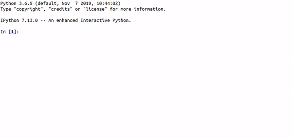
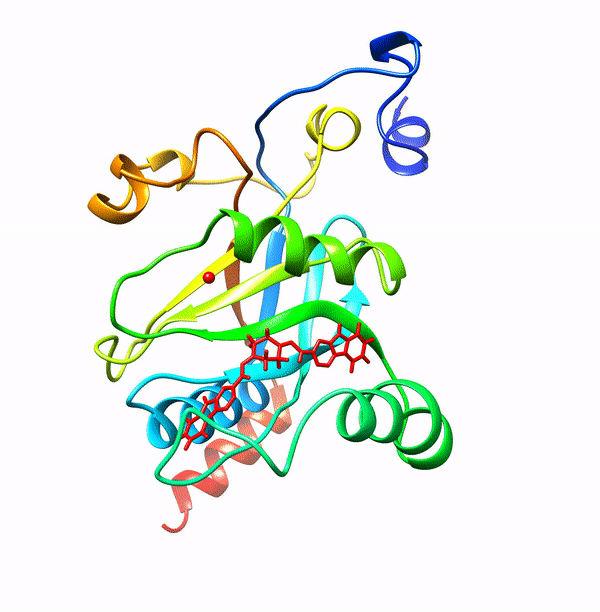

# Machine Learning-Enabled Pipeline for Large-Scale Virtual Drug Screening

# Library Trimming
Uses simple yet chemically important features to cluster small molecules. Presently, this code is designed to work with single receptor but idea can be easily framed to work with alomost every receptor. Potentilly used to reduce the number of drug molecules to be docked into the binding pocket of a protein. Hence, reducing the computational cost by 10-fold maximum.
We illustrated this work by clustering 1.3 million small molecules and diluting library to only ~130,000 molecules for further docking. Validation has been done by docking all 1.3 million compounds and just 130,000 compounds to check minimal impact on number of hits to be obtained.

Workflow:

Step1. Fetch features from ZINC-ID

Step2. Prediction of cluster and potent inhibitors

# Classification of True vs False positives
We trained a dense neural network with the classification label obtained from thousands of short scale molecular dynamics simulations. The saved model is trained on 824 ligand-RPN11 complex MD simulations and 1000 vina scores to classify true and false positives. We used over 5000 input features which includes ligand-protein interactions and ligand only descriptors. Input features were derived from Onionnet(https://github.com/zhenglz/onionnet) and PaDelPy (https://github.com/ECRL/PaDELPy).

Requirements:
sklearn, numpy, pandas, keras, and tensorflow

Onionnet:
python generate_features.py -inp inp.dat -out output.csv
  
PaDelpy:
padeldescriptor(mol_dir='./', d_2d=True, d_3d=True, d_file='descriptors.csv')

Usage:

Step1 : python auto_cluster.py -Rings -HBA -HBD -RB -logP

Step2 : if input == inhibitor: run AutoDock Vina to generate pose and then onionnet and padelpy ro generate features.

Step3 : python  -input DNN_classification features_filename

 

